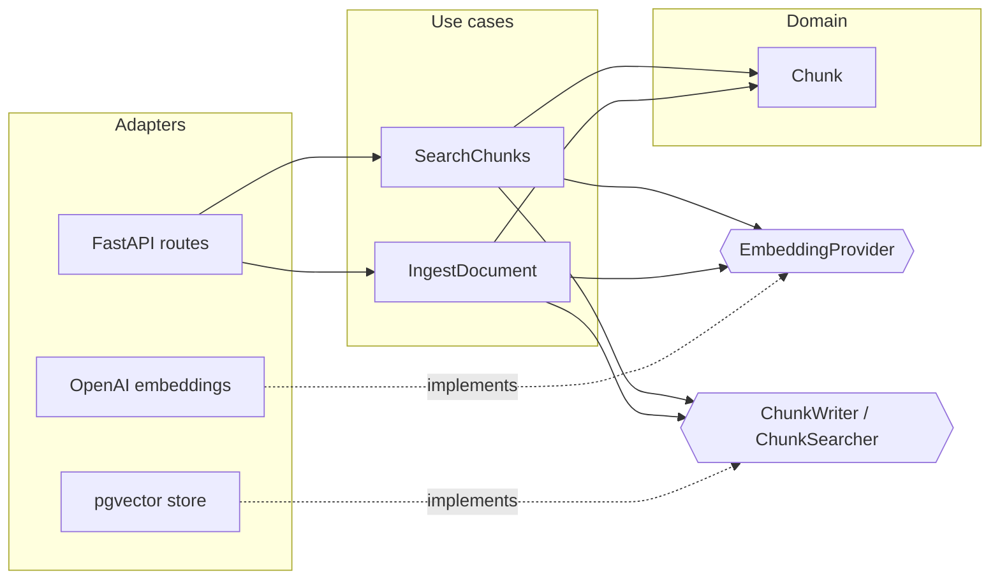

# evorag

A retrieval service for RAG (Retrieval-Augmented Generation), written in Python with Clean Architecture.

evorag ingests documents, splits them into overlapping token-based chunks, embeds them with OpenAI, stores the vectors in PostgreSQL + pgvector, and returns the most relevant chunks for a query. Answer generation is intentionally out of scope: evorag is the Python retrieval side of a hybrid system where [rag-service](https://github.com/YusufOztoprak/rag-service) (NestJS) handles the public API and generation.

## Features

- **Document ingestion:** token-based chunking with overlap (tiktoken), batched embedding in a single API call, transactional writes
- **Semantic search:** cosine similarity over pgvector with a configurable relevance threshold
- **Clean Architecture:** use cases depend only on ports; OpenAI, PostgreSQL and FastAPI are replaceable adapters
- **Structured logging:** one JSON line per event, with request ID, latency and token usage
- **Tested without infrastructure:** use cases are unit-tested with in-memory fakes; no database or API key required

## Architecture



Source code dependencies point inward only. Use cases define the ports (`typing.Protocol`) they need; adapters implement them. `main.py` is the composition root and the only module that knows every concrete class.

```
src/evorag/
  domain/          Chunk entity (plain frozen dataclass, no framework imports)
  ingestion/       IngestDocument use case, chunking, ChunkWriter port
  retrieval/       SearchChunks use case, ChunkSearcher port
  shared/          EmbeddingProvider port
  observability/   JSON log formatter, per-request context (request ID, token usage)
  adapters/
    http/          FastAPI routes, request/response schemas, request logging middleware
    openai_embeddings.py
    pgvector_store.py   SQLAlchemy model and domain mapping
  config.py        Settings loaded from .env (pydantic-settings)
  main.py          Composition root
tests/             Unit tests with in-memory fakes
alembic/           Database migrations
```

## Tech stack

Python 3.12 · FastAPI · Pydantic v2 · SQLAlchemy 2.0 (async) · asyncpg · Alembic · PostgreSQL 17 + pgvector · OpenAI `text-embedding-3-small` · tiktoken · pytest · ruff · uv · Docker Compose

## Getting started

**Prerequisites:** [uv](https://docs.astral.sh/uv/), Docker, an OpenAI API key.

```bash
git clone https://github.com/YusufOztoprak/evorag.git
cd evorag

cp .env.example .env          # then fill in the values
docker compose up -d          # PostgreSQL + pgvector
uv sync                       # install dependencies
uv run alembic upgrade head   # create the schema
uv run fastapi dev src/evorag/main.py
```

Interactive API docs: http://127.0.0.1:8000/docs

### Configuration

| Variable | Required | Default | Description |
|---|---|---|---|
| `POSTGRES_USER` | yes | | Database user |
| `POSTGRES_PASSWORD` | yes | | Database password |
| `POSTGRES_DB` | yes | | Database name |
| `OPENAI_API_KEY` | yes | | OpenAI API key |
| `MIN_SCORE` | no | `0.2` | Minimum cosine similarity for a search hit |

Required settings have no defaults on purpose: the service fails at startup with a clear error instead of failing on the first request.

## API

**Ingest a document**

```bash
curl -X POST http://127.0.0.1:8000/documents \
  -H "Content-Type: application/json" \
  -d '{"text": "The third chapter discusses methods for reconstructing phylogenetic trees..."}'
```

```json
{ "document_id": "e25ef4c4-b702-4d1b-bd99-bb006cdb46f4", "chunk_count": 1 }
```

**Search**

```bash
curl -X POST http://127.0.0.1:8000/search \
  -H "Content-Type: application/json" \
  -d '{"query": "How are phylogenetic trees reconstructed?", "limit": 3}'
```

```json
{
  "hits": [
    {
      "chunk_id": "5299a925-a253-43c1-8c00-7a18d6a5147f",
      "document_id": "e25ef4c4-b702-4d1b-bd99-bb006cdb46f4",
      "content": "From Darwin onward, ...",
      "score": 0.367
    }
  ]
}
```

## Design decisions

**Token-based chunking with overlap.** Embedding models measure input in tokens, so chunks are sized in tokens rather than characters. Overlap keeps sentences that fall on a boundary intact in at least one chunk. The chunker stops as soon as a window reaches the end of the text, so no trailing chunk consists only of overlap.

**Similarity threshold calibrated on data.** An initial threshold of 0.75 (carried over from an older embedding model) filtered out every result. Measuring real scores with `text-embedding-3-small` showed a relevant chunk at about 0.37 and unrelated ones below 0.08, so the default was lowered to 0.2. This is a first calibration on a small sample; a proper evaluation set is planned.

**Order and count safety at the embedding boundary.** Returned vectors are re-sorted by their `index`, and chunks are paired with vectors using `zip(..., strict=True)`. A count mismatch fails loudly; an order mismatch, which would otherwise silently attach the wrong vector to each chunk, cannot happen.

**Framework data stays at the edge.** pgvector returns numpy arrays; the adapter converts them to plain lists before they reach the domain. The HTTP layer returns `SearchHit` DTOs, not entities, so embeddings never leak into API responses.

## Observability

Every request is logged as JSON Lines (one JSON object per line), so logs can be filtered and aggregated by any log tool. Logging is built on the standard library only.

- **Request ID:** taken from the incoming `X-Request-ID` header (so calls from rag-service can be traced across both services) or generated; returned in the response header and attached to every log line via `contextvars`.
- **Latency:** total request time, plus a separate measurement for each OpenAI embedding call.
- **Token usage:** embedding tokens are summed per request without passing anything through the use cases; the domain and use-case layers stay free of logging concerns.

Example log lines for one `POST /documents` request (`ts`, `level` and `logger` fields omitted):

```json
{"event": "embedding.created", "request_id": "2a2c1c38...", "model": "text-embedding-3-small", "inputs": 1, "tokens": 18, "latency_ms": 390.19}
```

```json
{"event": "request.completed", "request_id": "2a2c1c38...", "method": "POST", "path": "/documents", "status": 201, "latency_ms": 439.52, "embedding_tokens": 18}
```

Separating the two latencies shows where time goes: in early measurements the OpenAI call took 89–97% of the total request time, while evorag's own work stayed at roughly 50 ms.

## Testing

```bash
uv run pytest -v
```

Use cases are tested against `FakeEmbeddingProvider` and `InMemoryChunkStore`, so the suite runs in well under a second without Docker or an API key. Observability is tested through a minimal FastAPI app with `TestClient` and `caplog`: request ID generation and propagation, token aggregation, and JSON formatting.

## Roadmap

- Timeouts, retries and fallbacks for OpenAI calls (tenacity)
- RabbitMQ consumer as a second entry point for asynchronous ingestion
- HNSW index for faster vector search
- Integration tests with Testcontainers and a CI pipeline (GitHub Actions)
- Retrieval evaluation with Ragas to calibrate chunk size and threshold

## License

[MIT](LICENSE)
